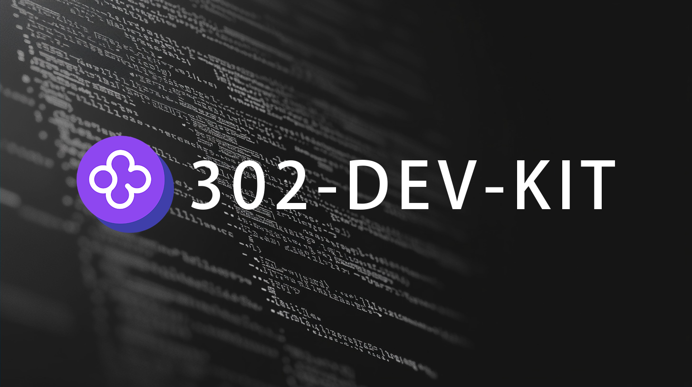

# <p align="center">🤖 302-Dev-Kit🚀✨</p>

<p align="center">`302-Dev-Kit` is a Next.js-based Web project aimed at providing a fast and efficient development experience based on the 302.AI API. This project includes basic components, hooks, and utility functions to help developers quickly build production-grade AI tool applications.</p>

<p align="center"><a href="https://302.ai/" target="blank"></a></p >

<p align="center"><a href="README_h.md">中文</a> | <a href="README.md">English</a> | <a href="README_ja.md">日本語</a></p>



## Features

- **Component-based Development**: Clear project structure with well-defined components, including public components, form components, global components, and basic components.
- **State Management**: Uses Zustand for state management.
- **Internationalization Support**: Built-in multi-language support (Chinese, English, Japanese).
- **Rich Utility Functions**: Includes API requests, authentication, event dispatching, and other utility functions.
- **Code Standards**: Uses ESLint and Prettier for code checking and formatting.

## Directory Structure

```plaintext
root
├── src
│   ├── app
│   ├── layout                     // Root layout
│   │── auth                       // Authentication page
│   │   ├── index                  // Export module
│   │   ├── _components            // Private components
│   ├── (land)                     // Landing page group
│   │   │── page                   // Main landing page
│   │   │── _components            // Private components
│   ├── components                 // Public components
│   │   ├── common                 // Common components
│   │   ├── forms                  // Form components
│   │   ├── global                 // Global components
│   │   ├── ui                     // Basic components
│   ├── constants                  // Constants
│   │   ├── forms                  // Form-related constants
│   │   ├── menus                  // Menu options
│   ├── hooks                      // Hooks
│   │   ├── auth                   // Authentication module hooks
│   │   ├── global                 // Global hooks
│   ├── icons                      // Icons
│   │   ├── auth                   // Authentication module icons
│   │   ├── global                 // Global module icons
│   ├── lib                        // Utility functions
│   │   ├── api                    // Request-related utility functions
│   │   ├── mitt                   // Event dispatching tool
│   │   ├── utils                  // Other utility sets
│   ├── services                   // Request functions
│   │   ├── auth                   // Authentication requests
│   ├── locales                    // Internationalization
│   │   ├── zh                     // Chinese
│   │   ├── en                     // English
│   │   ├── ja                     // Japanese
│   ├── stores                     // State management
│   │   ├── slices                 // Divided module states
│   │   ├── index                  // Export module
│   ├── styles                     // Styles
│   │   ├── global                 // Global styles
│   │   ├── info                   // Information styles
│   ├── env.ts                     // Environment variable control
└── package.json
```

## Installation

1. Clone the repository:

   ```bash
   git clone https://github.com/302ai/302-Dev-Kit
   ```

2. Install dependencies:

   ```bash
   cd 302-Dev-Kit
   npm install
   ```

## Script Commands

- `npm run build`: Build for production environment.
- `npm run dev`: Start development environment.
- `npm run lint`: Run ESLint for code checking.
- `npm run start`: Start production environment.
- `npm run clean`: Clean generated build files.
- `npm run check`: Check code format.
- `npm run format`: Format code.

## Dependencies

### Production Dependencies

- `@hookform/error-message`
- `@hookform/resolvers`
- `@radix-ui/react-alert-dialog`
- `@radix-ui/react-checkbox`
- `@radix-ui/react-dialog`
- `@radix-ui/react-dropdown-menu`
- `@radix-ui/react-icons`
- `@radix-ui/react-label`
- `@radix-ui/react-slot`
- `@radix-ui/react-toast`
- `@t3-oss/env-nextjs`
- `@tanstack/react-query`
- `ahooks`
- `class-variance-authority`
- `clsx`
- `geist`
- `jiti`
- `ky`
- `ll`
- `lucide-react`
- `mitt`
- `next`
- `next-themes`
- `react`
- `react-dom`
- `react-hook-form`
- `tailwind-merge`
- `tailwindcss-animate`
- `zod`
- `zustand`

### Development Dependencies

- `@trivago/prettier-plugin-sort-imports`
- `@types/eslint`
- `@types/node`
- `@types/react`
- `@types/react-dom`
- `@typescript-eslint/eslint-plugin`
- `@typescript-eslint/parser`
- `eslint`
- `eslint-config-next`
- `eslint-config-prettier`
- `eslint-plugin-check-file`
- `eslint-plugin-n`
- `eslint-plugin-tailwindcss`
- `postcss`
- `prettier`
- `prettier-plugin-tailwindcss`
- `tailwindcss`
- `typescript`

## Development Guide

### Start Development Environment

```bash
npm run dev
```

### Build Production Environment

```bash
npm run build
```

## Code Style and Standards

Use ESLint for code checking and Prettier for code formatting. Please ensure your code passes checks and formatting before submitting.

```bash
npm run lint
npm run format
```

## Internationalization

The project supports multiple languages, currently including Chinese, English, and Japanese. Language files are stored in the `src/locales` directory.

## License

This project is licensed under the MIT License.
